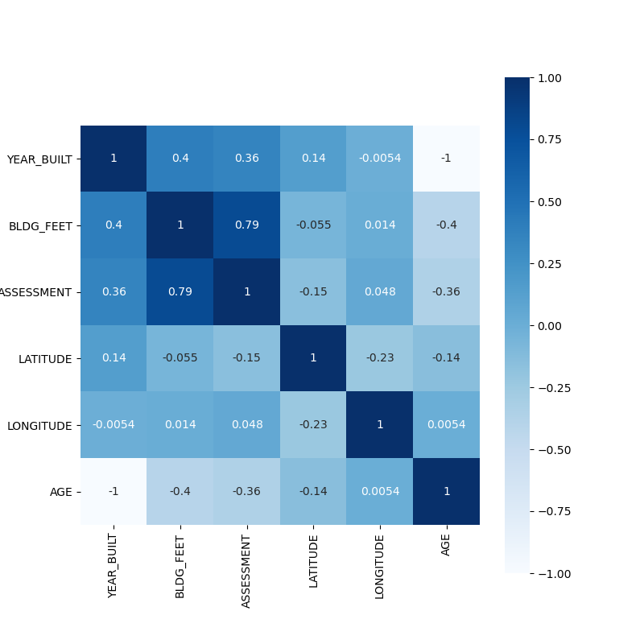
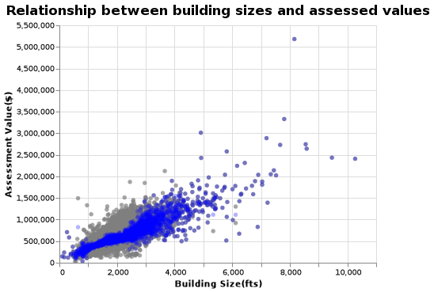
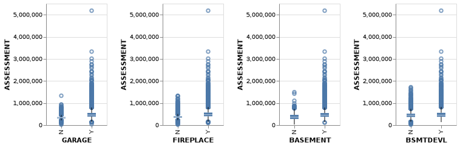

# Summary

We build a linear regression model that predicts property assessment values of single-family dwellings in Strathcona County, Alberta, Canada. Our model is restricted to 2018 data, and models property assessment values based on several property-related attributes such as building size, age, and building type. Our quick-and-dirty regression performed adequately well on out-of-sample data, with an R-square of 0.78. 

# Introduction

Property taxes are a major source of revenue that funds municipal operations. Mass market appraisal is the common approach municipalities take to determine the fair-market value of the properties it collects taxes on. However, few municipalities release publicly their property assessments, and fewer still publicly release property-attributes tied to this mass market appraisal. Strathcona County is an exception, and releases annual property assessment information for all of its properties on its [Open Data portal](https://data.strathcona.ca/). 


# Methods

## Data

The data set used in our project are [2018 property assessments](https://data.strathcona.ca/Housing-Buildings/2018-Property-Tax-Assessment/6wvk-j7e9), restricted strictly for single-family dwellings in Strathcona County, Alberta. Each row in the data set represents a distinct property within Strathcona Counties borders, and each column represents a potential explanatory variable, along with our dependent variable (property assessment value). Our set of explanatory variables is composed of continuous, categorical, and binary data types, these being: Building Size, Building Description, Age of Property, Year Built, Presence of Basement, Presence of Furnished Basement, Presence of Garage, Presence of Fireplace, and Longitude and Latitude. Altogether our dataset is composed of 28,450 observations.
To get an accurate assessment of our predictive model, we build a training model using 90% of our observations, and reserve the remaining 10% as test data to assess goodness of fit.
Our data pipeline modelling involved several steps. First, we identified our features by their data types. Each of these data types were then subject to different transformations. For instance, our binary features were in the form of “Yes/No” and needed to be converted into 0’s and 1’s via One Hot Encoding. We also had a categorical feature that takes on several dozen distinct values, and required converting to a set of binary variables via the use of One Hot Encoding.


## Exploratory Data Analysis

Our dependent variable - property assessment value - exhibits right skew. Most property assessment values are centered between $400,000 and $500,000. While almost no property is worth less than $300,000, there are a number of outlier properties that exceed $1,000,000 and approach up to $2,000,000.


<div class="figure">

<p class="caption">Figure 1. Assessment value frequency distribution</p>
</div>

A quick glance of our data found a small number of observations with missing values for particular features. These observations were later dropped from our model. 


```
## <class 'pandas.core.frame.DataFrame'>
## RangeIndex: 25605 entries, 0 to 25604
## Data columns (total 12 columns):
##  #   Column      Non-Null Count  Dtype  
## ---  ------      --------------  -----  
##  0   YEAR_BUILT  25597 non-null  float64
##  1   ASSESSCLAS  25605 non-null  object 
##  2   BLDG_DESC   25597 non-null  object 
##  3   BLDG_FEET   25605 non-null  int64  
##  4   GARAGE      25605 non-null  object 
##  5   FIREPLACE   25605 non-null  object 
##  6   BASEMENT    25605 non-null  object 
##  7   BSMTDEVL    25605 non-null  object 
##  8   ASSESSMENT  25605 non-null  int64  
##  9   LATITUDE    25605 non-null  float64
##  10  LONGITUDE   25605 non-null  float64
##  11  AGE         25597 non-null  float64
## dtypes: float64(4), int64(2), object(6)
## memory usage: 2.3+ MB
```

The correlation heat map -restricted to only our numeric features - shows that the property assessment value has its strongest correlation with square footage (with a correlation of 0.79). The second most correlated feature to property assessment value is age of the property (correlation of 0.36) which can be reflected from the year built feature. 
<div class="figure">

<p class="caption">Figure 2. Housing features correlation heatmap</p>
</div>

A closer look at a scatter plot of property assessment values and square footage shows a clear positive association. However, its apparent that the tightness of this relationship loosens as property assessment values become increasingly large. 


<div class="figure">

<p class="caption">Figure 3. Building size vs assessment value scatterplot</p>
</div>


Box plots were used to examine the distribution of property assessment values for several of our binary property-attribute features. We notice the median property assessment values tend to be very similar regardless of the presence of these property-attributes, although there tends to be more of a concentration of high-value property assessment outliers when the attribute is present. 

<div class="figure">

<p class="caption">Figure 4. Binary housing features vs assessment value boxplots</p>
</div>

## Analysis

We fitted our training data under a number of candidate models. Before this took place, the features were classified in three types in order to conduct distinct transformations: categorical features, binary features and continuous features.

For the Ridge Regression model, the alpha hyperparameter was optimized using cross-validation over the discrete set of alpha values of 0.0001, 0.001, 0.01, and up to 1000. Assessment of the model, based on training data only, was made with cross-validation (using 5-folds) and was scored using $R^2$. 

For the Random Forest Regressor model, 70 estimators were estimated along with using a max depth of 5. Our XGBoost Regressor model used the same hyperparameter values.  

XGBoost had the best cross-validation score, with an $R^2$ of 0.896, compared to the other models which ranged from 0.77 to 0.80. Overfitting with XGBoost appears moderate based on the scoring performance gap between its training score and cross-validation score.


Table: Table 1. Mean Scoring Metrics Using Cross-Validation

|Metric      | Dummy Regression Model| Ridge Regression Model| Random Forest Regressor| XGBoost Regressor|
|:-----------|----------------------:|----------------------:|-----------------------:|-----------------:|
|fit_time    |              0.0018001|              1.2581116|               2.5718910|         1.5510944|
|score_time  |              0.0003996|              0.0095090|               0.0350014|         0.0308010|
|test_score  |             -0.0001442|              0.7669276|               0.8015252|         0.8963127|
|train_score |              0.0000000|              0.7688487|               0.8231964|         0.9466038|


Table: Table 2. Test score using `Ridge` regression model from `sklearn`

|Metric     | Ridge regression score|
|:----------|----------------------:|
|test_score |              0.7881277|

Looking at our coefficients table, our model found that a one sq foot increase in property size was associated with a \$284 increase in property assessment value. Features like the property having a garage or fireplace was associated with an increase in assessment value of \$20,637 and \$2186 respectively. Coefficients that indicate the property building type were found to have very large, and sometimes unintuitive coefficient sizes. Although our model assumes that one explanatory variable can change while keeping the others constant, the validity of this is a potential concern. 

The programming language Python was used in our research along with the Python-associated packages: Numpy [@harris2020array], Pandas [@mckinney2015pandas], Altair [@Altair2018], Seaborn [@waskom2020seaborn], and Scikit-Learn [@scikit-learn]. The code used to perform the analysis and create this report can be found [here](https://github.com/UBC-MDS/522-Group_30-Rockstars/blob/main/src/housing_assessment_prediction.py).

## Limitations + Future 

Property location is a useful determinant of property values, however, our use of longitude/latitude coordinates is limited. These features would be much more useful if they were converted into neighbourhood identification. Future work could incorporate this as Strathcona County makes available polygon shape files that indicate the latitude/longitude boundaries of its neighbourhoods. 

Our modelling here was restrained to Ridge Regression, and it would be worthwhile to compare prediction results to other well known models including the traditional Multiple Linear Regression and Random Forest Regression. Other more advanced and novel methods/models could be considered. Fuzzy Logic has been applied for housing price prediction in a city in Turkey [@kucsan2010use], while Machine-Learning approaches of C4.5, RIPPER, Naïve Bayesian, and AdaBoost have been evaluated for house price prediction in Fairfax County, Virginia [@park2015using].

While our dataset had a reasonably large number of observations, the data is available to incorporate multiple years of property assessment observations into the model. However, this would cause our observations to not be entirely independent from one another, which would require some adjustments in our modelling.


# References
